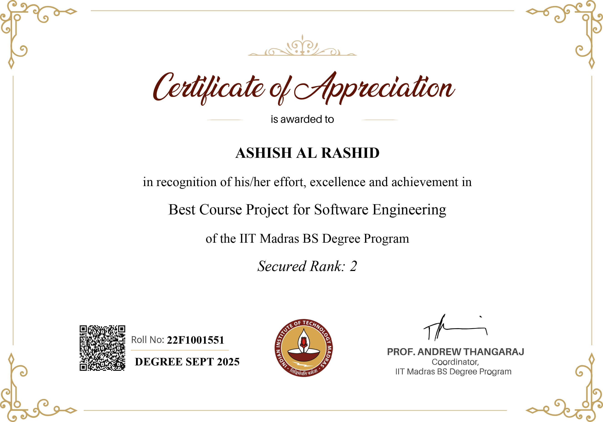

# HR Recruitment Platform

## BEST PROJECT WINNER SEPT-2025

I received the **Best Project Award** for its design and technical execution.




## Run the full stack with Docker

1. Ensure Docker (with Compose v2) is installed and running.
2. From the project root, build and start every service:
   ```
   docker compose up --build
   ```
3. Open the app at `http://localhost:5173`. The backend API is kept internal to the Docker network (consumed via the frontend proxy), and the auto-built documentation portal is served from `http://localhost:8090`.

When you're done, stop the stack with `Ctrl+C` or run `docker compose down`.

## Build the documentation

The `docs/` directory contains two Sphinx modules that live under the same roof:

- **Backend** – `docs/backend`, auto-generated from the Flask modules.
- **Frontend** – `docs/frontend`, authored in reStructuredText and grounded in the Vue source tree.

To build both outputs locally:

```
./scripts/build_docs.sh
```

The script installs `docs/requirements.txt`, runs `make -C docs html`, and emits static sites under `docs/build/backend`, `docs/build/frontend`, plus a shared landing page at `docs/build/index.html`.

### Where everything is served

| Surface | URL | Notes |
| --- | --- | --- |
| Frontend SPA | `http://localhost:5173` | Vue + Vite dev server inside the `frontend` container. |
| Backend API (internal) | `http://backend:8086` | Flask app served by Gunicorn inside the `backend` container. Reach it from other containers (e.g., the frontend proxy) or run `docker compose exec backend curl http://localhost:8086/health` for manual checks. |
| Documentation portal | `http://localhost:8090` | Built automatically by the `docs` container and also generated locally in `docs/build/`. |
| Redis | `redis://localhost:6379` | Used by the backend for caching and Celery broker needs. |

> The central `docker compose up --build` command also creates the `docs` service so documentation is rebuilt and hosted alongside the app every time the stack starts.
